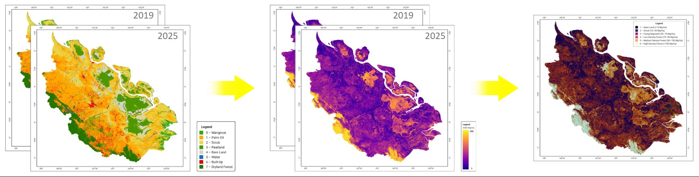

<h1 align="center">🌴 LAND USE LAND COVER & STRATIFIKASI HCS — PROVINSI RIAU</h1>

<p align="center">
  
</p>

<p align="center">
  
  
  
  
  
</p>

---

## 📋 Daftar Isi

- [📖 Deskripsi Proyek](#-deskripsi-proyek)
- [🗺️ Wilayah Studi & Cakupan Temporal](#️-wilayah-studi--cakupan-temporal)
- [✨ Fitur Utama](#-fitur-utama)
- [📊 Analisis Dataset](#-analisis-dataset)
  - [Dimensi Dataset](#dimensi-dataset)
  - [Variabel & Prediktor](#variabel--prediktor)
  - [Kelas Tutupan Lahan](#kelas-tutupan-lahan)
  - [Statistik Deskriptif](#statistik-deskriptif)
- [⚙️ Metodologi](#️-metodologi)
- [📈 Hasil Evaluasi Model](#-hasil-evaluasi-model)
- [📁 Struktur Folder dan File](#-struktur-folder-dan-file)
- [🛠️ Teknologi yang Digunakan](#️-teknologi-yang-digunakan)
- [🚀 Panduan Menjalankan Secara Lokal](#-panduan-menjalankan-secara-lokal)
  - [1. Clone Repository](#1-clone-repository)
  - [2. Konfigurasi Google Earth Engine](#2-konfigurasi-google-earth-engine)
  - [3. Menjalankan Script Klasifikasi](#3-menjalankan-script-klasifikasi)
- [🔑 Catatan Penting](#-catatan-penting)

---

## 📖 Deskripsi Proyek

**Riau Land Use Land Cover (LULC) & Stratifikasi HCS** adalah proyek analisis geospasial berbasis **Remote Sensing** dan **Machine Learning** yang bertujuan memetakan tutupan/penggunaan lahan di **Provinsi Riau** secara multitemporal, dari tahun **2019 hingga 2025**, sekaligus menjadi dasar bagi **stratifikasi High Carbon Stock (HCS)**.

Pendekatan HCS digunakan secara luas pada lanskap perkebunan kelapa sawit untuk mengidentifikasi area dengan stok karbon dan nilai konservasi tinggi (umumnya kelas hutan dan vegetasi rapat) yang perlu dilindungi dari konversi lahan, dipisahkan dari area dengan stok karbon rendah (semak, lahan terbuka, area terbangun) yang berpotensi dikembangkan. Provinsi Riau dipilih sebagai wilayah studi karena memiliki dinamika perubahan lahan yang tinggi akibat ekspansi perkebunan kelapa sawit, aktivitas gambut/lahan basah, dan tekanan deforestasi.

Proyek ini memanfaatkan citra satelit (optik dan radar) yang diproses melalui **Google Earth Engine (GEE)** untuk mengekstraksi fitur spektral, tekstur radar, dan topografi, yang kemudian digunakan untuk melatih tiga algoritma klasifikasi: **CART (Classification and Regression Tree)**, **Random Forest (RF)**, dan **Gradient Boosting (GB)**. Model dengan performa terbaik (Random Forest) selanjutnya digunakan untuk menghasilkan peta LULC tahunan sepanjang periode 2019–2025 (total 6 peta tahunan) di seluruh wilayah Provinsi Riau.

---

## 🗺️ Wilayah Studi & Cakupan Temporal

| Parameter | Keterangan |
|---|---|
| **Wilayah Studi** | Provinsi Riau, Indonesia |
| **Periode Analisis** | 2019 – 2025 |
| **Jumlah Peta Tahunan** | 6 peta (satu peta per tahun) |
| **Jumlah Kelas LULC** | 8 kelas |
| **Model Visualisasi Peta** | Random Forest (RF) |
| **Tujuan Akhir** | Pemetaan LULC & stratifikasi HCS untuk identifikasi area stok karbon tinggi |

---

## ✨ Fitur Utama

| No. | Fitur | Deskripsi |
|-----|-------|-----------|
| 1 | 🛰️ **Ekstraksi Fitur Multi-Sensor** | Menggabungkan data optik, radar (SAR), indeks spektral, dan topografi sebagai prediktor klasifikasi |
| 2 | 🤖 **Perbandingan Tiga Algoritma** | Melatih dan mengevaluasi model CART, Random Forest, dan Gradient Boosting untuk klasifikasi 8 kelas LULC |
| 3 | 📊 **Evaluasi Kuantitatif Lengkap** | Menyajikan metrik akurasi, kappa, precision, recall, dan F1-score per kelas untuk setiap model |
| 4 | 🗺️ **Pemetaan Multitemporal** | Menghasilkan peta LULC tahunan (2019–2025) menggunakan model Random Forest sebagai model terpilih |
| 5 | 🌳 **Dasar Stratifikasi HCS** | Hasil klasifikasi digunakan sebagai input untuk identifikasi area High Carbon Stock di lanskap Riau |
| 6 | 💾 **Dataset Tersusun Rapi** | Dataset sampel pelatihan tersedia dalam format CSV dengan struktur yang konsisten antar tahun |

---

## 📊 Analisis Dataset

### Dimensi Dataset

Dataset pelatihan yang digunakan dalam proyek ini memiliki struktur sebagai berikut:

| Atribut | Nilai |
|---|---|
| Jumlah total sampel | 16.000 |
| Jumlah kolom total | 25 |
| Jumlah prediktor (fitur) | 22 |
| Kolom non-prediktor | `system:index`, `class`, `.geo` |
| Jumlah kelas | 8 (seimbang, masing-masing 2.000 sampel) |
| Data hilang (*missing values*) | Tidak ada (0) |
| Proporsi *split* data latih : uji | 80% : 20% (12.808 : 3.192 sampel) |

Setiap baris merepresentasikan satu titik sampel hasil *point sampling* pada citra satelit, lengkap dengan koordinat geografis yang tersimpan pada kolom `.geo` (format GeoJSON Point).

### Variabel & Prediktor

Dua puluh dua (22) prediktor yang digunakan dikelompokkan menjadi empat kategori berdasarkan sumber dan jenis informasinya:

**1. Indeks Spektral**

| Variabel | Nama Lengkap | Kegunaan |
|---|---|---|
| `NDVI` | Normalized Difference Vegetation Index | Mengukur kerapatan dan kesehatan vegetasi |
| `NDWI` | Normalized Difference Water Index | Mendeteksi keberadaan badan air dan kebasahan lahan |
| `MNDWI` | Modified NDWI | Penajaman deteksi air, mengurangi gangguan vegetasi/bangunan |
| `NDBI` | Normalized Difference Built-up Index | Mengidentifikasi area terbangun (built-up) |
| `NDTI` | Normalized Difference Tillage/Turbidity Index | Membedakan tutupan tanah terbuka/lahan terganggu |

**2. Band Reflektansi Optik**

| Variabel | Keterangan |
|---|---|
| `blue`, `green`, `red` | Band spektrum tampak (visible) |
| `nir` | Near-Infrared, sensitif terhadap kerapatan vegetasi |
| `swir1`, `swir2` | Short-Wave Infrared, sensitif terhadap kelembapan dan jenis tutupan lahan |

**3. Fitur Radar SAR (Sentinel-1)**

| Variabel | Keterangan |
|---|---|
| `VV`, `VH` | Backscatter polarisasi vertikal-vertikal dan vertikal-horizontal |
| `VV_contrast`, `VH_contrast` | Fitur tekstur GLCM — kontras |
| `VV_corr`, `VH_corr` | Fitur tekstur GLCM — korelasi |
| `VV_ent`, `VH_ent` | Fitur tekstur GLCM — entropi |

Fitur SAR berperan penting untuk membedakan kelas yang sulit dipisahkan secara spektral murni (misalnya hutan vs. perkebunan sawit, atau lahan basah vs. semak), karena radar sensitif terhadap struktur kanopi dan kandungan air permukaan, serta tidak terganggu oleh tutupan awan.

**4. Fitur Topografi (turunan DEM)**

| Variabel | Keterangan |
|---|---|
| `dem` | Elevasi (Digital Elevation Model) |
| `slope` | Kemiringan lereng |
| `aspect` | Arah hadap lereng |

Fitur topografi membantu memisahkan kelas yang berasosiasi dengan kondisi lahan tertentu, misalnya lahan basah/gambut yang cenderung berada di elevasi rendah dan datar.

### Kelas Tutupan Lahan

Dataset terdiri dari **8 kelas** dengan distribusi yang seimbang (*balanced*), masing-masing berjumlah 2.000 sampel:

| Kode Kelas | Nama Kelas | Jumlah Sampel | Relevansi terhadap HCS |
|---|---|---|---|
| 0 | Mangrove | 2.000 | Vegetasi pesisir, umumnya stok karbon tinggi |
| 1 | Palm Oil (Kelapa Sawit) | 2.000 | Area budidaya, stok karbon rendah–sedang |
| 2 | Scrub (Semak Belukar) | 2.000 | Vegetasi sekunder, kandidat area konversi |
| 3 | Wetland (Lahan Basah) | 2.000 | Ekosistem gambut/rawa, perlu perlindungan |
| 4 | Bare Land (Lahan Terbuka) | 2.000 | Stok karbon sangat rendah |
| 5 | Water (Badan Air) | 2.000 | Sungai, danau, kanal |
| 6 | Built-Up (Area Terbangun) | 2.000 | Permukiman dan infrastruktur |
| 7 | Forest (Hutan) | 2.000 | Stok karbon tertinggi, prioritas konservasi HCS |

Kelas-kelas ini dipilih agar selaras dengan pendekatan stratifikasi HCS, di mana kelas **Forest** dan **Mangrove** umumnya masuk kategori stok karbon tinggi yang wajib dipertahankan, sementara **Scrub**, **Bare Land**, dan **Built-Up** merepresentasikan area dengan stok karbon rendah yang menjadi fokus identifikasi area pengembangan.

### Statistik Deskriptif

Ringkasan rentang nilai (*min–max*) dan rata-rata dari sebagian prediktor numerik kunci:

| Prediktor | Min | Max | Rata-rata | Std. Dev |
|---|---|---|---|---|
| NDVI | -1.0000 | 0.9212 | 0.5940 | 0.3614 |
| NDWI | -0.8392 | 1.0000 | -0.5257 | 0.3326 |
| MNDWI | -0.7165 | 0.7519 | -0.3354 | 0.2667 |
| NDBI | -0.6911 | 1.0000 | -0.2722 | 0.2323 |
| VV (dB) | -30.71 | 23.16 | -9.67 | 5.98 |
| VH (dB) | -40.64 | 13.55 | -15.82 | 5.31 |
| dem (mdpl) | 0.00 | 1078.26 | 71.35 | 152.90 |
| slope (°) | 0.00 | 54.00 | 4.43 | 7.82 |

Tidak ditemukan nilai yang hilang (*missing value*) pada seluruh kolom prediktor, sehingga dataset siap digunakan langsung untuk proses pelatihan model tanpa tahap imputasi tambahan.

---

## ⚙️ Metodologi

Alur kerja analisis LULC pada proyek ini secara garis besar mengikuti tahapan berikut:

1. **Pengumpulan & Pra-pemrosesan Citra** — Akuisisi citra optik dan SAR melalui Google Earth Engine, perhitungan indeks spektral, serta ekstraksi fitur tekstur GLCM dan topografi.
2. **Pembuatan Sampel Pelatihan** — Pengumpulan 16.000 titik sampel pada 8 kelas tutupan lahan secara seimbang, mencakup 22 variabel prediktor per titik.
3. **Pembagian Data** — Dataset dibagi menjadi data latih (80%, 12.808 sampel) dan data uji (20%, 3.192 sampel).
4. **Pelatihan Model** — Tiga algoritma klasifikasi dilatih dan dibandingkan: **CART**, **Random Forest**, dan **Gradient Boosting**.
5. **Evaluasi Model** — Setiap model dievaluasi menggunakan *overall accuracy*, *kappa coefficient*, serta precision, recall, dan F1-score per kelas pada data uji.
6. **Pemetaan Tahunan** — Model dengan performa terbaik dan paling stabil (**Random Forest**) diterapkan untuk mengklasifikasikan citra pada setiap tahun (2019–2025), menghasilkan total 6 peta LULC tahunan untuk seluruh Provinsi Riau.
7. **Stratifikasi HCS** — Peta LULC tahunan digunakan sebagai dasar penentuan strata stok karbon tinggi dan rendah pada lanskap perkebunan kelapa sawit.

---

## 📈 Hasil Evaluasi Model

### Ringkasan Kinerja Keseluruhan

| Model | Akurasi | Kappa |
|---|---|---|
| CART | 0.9549 (95.49%) | 0.9484 |
| Random Forest | 0.9915 (99.15%) | 0.9903 |
| Gradient Boosting | 0.9919 (99.19%) | 0.9907 |

### Detail Per Kelas — CART

| Kelas | Precision | Recall | F1-Score | Support |
|---|---|---|---|---|
| Mangrove | 0.9413 | 0.9625 | 0.9518 | 400 |
| Palm Oil | 0.9549 | 0.9160 | 0.9351 | 393 |
| Scrub | 0.9229 | 0.9576 | 0.9400 | 425 |
| Wetland | 0.8855 | 0.9431 | 0.9134 | 369 |
| Bare Land | 0.9629 | 0.9190 | 0.9404 | 395 |
| Water | 1.0000 | 1.0000 | 1.0000 | 409 |
| Built-Up | 0.9744 | 0.9383 | 0.9560 | 405 |
| Forest | 1.0000 | 1.0000 | 1.0000 | 396 |
| **Macro Avg** | **0.9552** | **0.9546** | **0.9546** | 3192 |
| **Weighted Avg** | **0.9557** | **0.9549** | **0.9550** | 3192 |

### Detail Per Kelas — Random Forest

| Kelas | Precision | Recall | F1-Score | Support |
|---|---|---|---|---|
| Mangrove | 0.9876 | 0.9925 | 0.9900 | 400 |
| Palm Oil | 0.9871 | 0.9720 | 0.9795 | 393 |
| Scrub | 0.9929 | 0.9906 | 0.9918 | 425 |
| Wetland | 0.9733 | 0.9892 | 0.9812 | 369 |
| Bare Land | 0.9949 | 0.9949 | 0.9949 | 395 |
| Water | 1.0000 | 1.0000 | 1.0000 | 409 |
| Built-Up | 0.9950 | 0.9926 | 0.9938 | 405 |
| Forest | 1.0000 | 1.0000 | 1.0000 | 396 |
| **Macro Avg** | **0.9914** | **0.9915** | **0.9914** | 3192 |
| **Weighted Avg** | **0.9916** | **0.9915** | **0.9915** | 3192 |

### Detail Per Kelas — Gradient Boosting

| Kelas | Precision | Recall | F1-Score | Support |
|---|---|---|---|---|
| Mangrove | 0.9900 | 0.9900 | 0.9900 | 400 |
| Palm Oil | 0.9772 | 0.9822 | 0.9797 | 393 |
| Scrub | 0.9883 | 0.9906 | 0.9894 | 425 |
| Wetland | 0.9864 | 0.9837 | 0.9851 | 369 |
| Bare Land | 0.9949 | 0.9924 | 0.9937 | 395 |
| Water | 1.0000 | 1.0000 | 1.0000 | 409 |
| Built-Up | 0.9975 | 0.9951 | 0.9963 | 405 |
| Forest | 1.0000 | 1.0000 | 1.0000 | 396 |
| **Macro Avg** | **0.9918** | **0.9917** | **0.9918** | 3192 |
| **Weighted Avg** | **0.9919** | **0.9919** | **0.9919** | 3192 |

### Catatan Singkat

Random Forest dan Gradient Boosting jauh mengungguli CART dengan margin sekitar 4 poin akurasi, sementara selisih keduanya tipis (0,0003). Kelas Water dan Forest sempurna (precision/recall/F1 = 1,0) di ketiga model, sedangkan kelas Wetland dan Palm Oil paling sering tertukar, terlihat dari nilai precision/recall yang relatif lebih rendah di semua model, terutama pada CART. **Random Forest** dipilih sebagai model untuk pemetaan visual karena performanya yang sangat tinggi dan relatif lebih stabil/cepat dilatih dibanding Gradient Boosting, sehingga lebih praktis diterapkan secara berulang pada 6 tahun citra.

---

## 📁 Struktur Folder dan File

```
riau-land-use-land-cover/
│
├── data/                        # Dataset sampel pelatihan & hasil klasifikasi
│   └── landuse_landcover_dataset.csv   # Dataset sampel (16.000 titik, 22 prediktor, 8 kelas)
│
├── images/                      # Aset gambar (preview peta, hasil visualisasi)
│   └── preview_map.png          # Preview peta LULC hasil model Random Forest
│
├── src/                         # Script Google Earth Engine (JavaScript)
│   ├── preprocessing.js         # Ekstraksi indeks spektral, fitur SAR, dan topografi
│   ├── sampling.js              # Pembuatan titik sampel per kelas
│   ├── training.js              # Pelatihan model CART, RF, dan GB
│   ├── evaluation.js            # Perhitungan akurasi, kappa, dan classification report
│   └── mapping.js               # Klasifikasi & ekspor peta tahunan (2019–2025)
│
└── README.md                    # Dokumentasi proyek
```

> Struktur di atas dapat disesuaikan dengan susunan berkas aktual pada folder `src/` dan `data/` di repositori.

---

## 🛠️ Teknologi yang Digunakan

| Layer | Teknologi |
|-------|-----------|
| **Remote Sensing & Geoprocessing** | Google Earth Engine (GEE) JavaScript API |
| **Sumber Citra** | Citra optik (indeks spektral, band reflektansi), Sentinel-1 SAR (VV/VH + tekstur GLCM), DEM |
| **Machine Learning** | CART, Random Forest, Gradient Boosting (`ee.Classifier`) |
| **Evaluasi Model** | Confusion matrix, *overall accuracy*, *kappa coefficient*, precision/recall/F1-score |
| **Visualisasi** | GEE Code Editor / Map, ekspor peta ke Google Drive / Asset |

---

## 🚀 Panduan Menjalankan Secara Lokal

### 1. Clone Repository

```bash
git clone https://github.com/pan-don/riau-land-use-land-cover.git
cd riau-land-use-land-cover
```

### 2. Konfigurasi Google Earth Engine

> **⚠️ Langkah ini WAJIB dilakukan sebelum menjalankan script.**

1. Pastikan memiliki akun **Google Earth Engine** yang sudah teraktivasi: [https://signup.earthengine.google.com](https://signup.earthengine.google.com)
2. Buka [Earth Engine Code Editor](https://code.earthengine.google.com/)
3. Pastikan **Cloud Project** sudah terdaftar pada akun Earth Engine Anda (menu **Assets** → **Cloud Projects**)

### 3. Menjalankan Script Klasifikasi

1. Import seluruh berkas pada folder `src/` ke dalam *script repository* akun GEE Anda
2. Sesuaikan parameter wilayah (ROI Provinsi Riau), rentang tahun, dan path *asset* dataset sampel pada `data/`
3. Jalankan script secara berurutan: pra-pemrosesan → pelatihan model → evaluasi → pemetaan tahunan
4. Ekspor hasil klasifikasi tiap tahun (2019–2025) sebagai *asset* GEE atau citra GeoTIFF ke Google Drive

```javascript
// Contoh pemanggilan classifier pada GEE
var classifier = ee.Classifier.smileRandomForest(100)
  .train({
    features: trainingSamples,
    classProperty: 'class',
    inputProperties: predictorBands
  });

var classifiedImage = compositeImage.classify(classifier);
```

---

## 🔑 Catatan Penting

| ✅ Yang Disarankan | ❌ Yang Sebaiknya Dihindari |
|------------------------|------------------------------|
| Gunakan dataset sampel yang konsisten antar tahun untuk menjaga kualitas pelatihan | Jangan mencampur sampel dari tahun berbeda tanpa harmonisasi citra |
| Lakukan validasi lapangan (*ground truth*) secara berkala untuk menjaga akurasi peta | Jangan mengandalkan akurasi data uji semata tanpa validasi independen |
| Simpan parameter model (jumlah pohon, kedalaman, dsb.) untuk reproduktivitas | Jangan mengubah parameter model tanpa mendokumentasikan perubahannya |
| Perbarui stratifikasi HCS setiap kali peta tahunan baru tersedia | Jangan menggunakan peta lama sebagai dasar keputusan stratifikasi terkini |

---

<p align="center">
  Geospatial Research Project · Provinsi Riau · 2019–2025
</p>